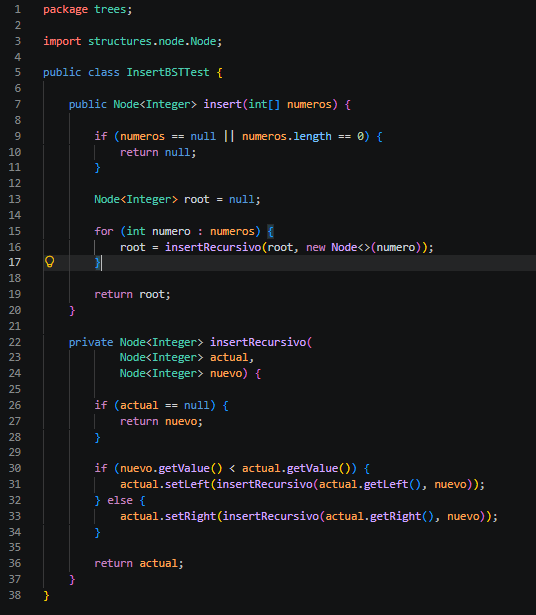
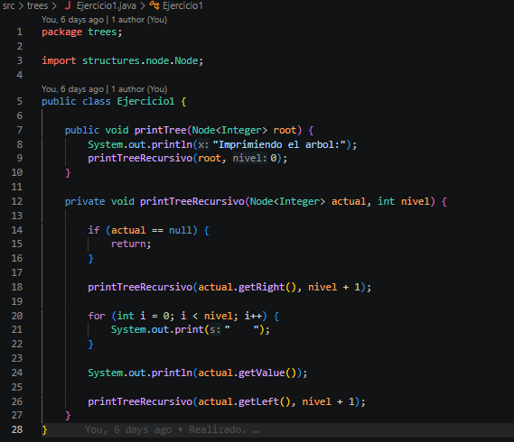
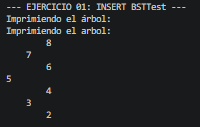
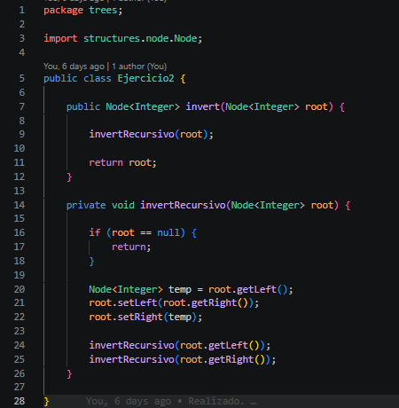
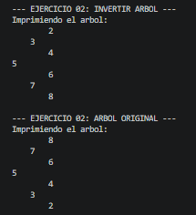
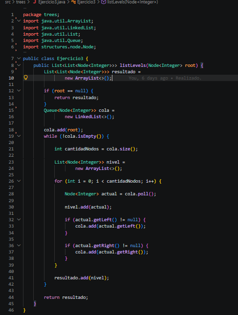
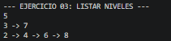
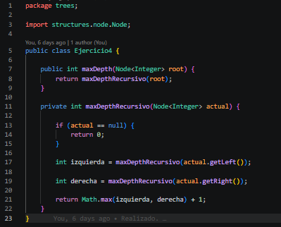
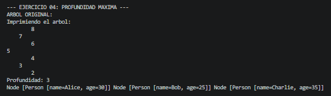

# Práctica: Estructuras Dinámicas No Lineales

## Datos del Estudiante

* **Nombre:** Nicole Estefania Dominguez Muñoz
* **Curso:** grupo #3

---

## Descripcion general del proyecto

En este proyecto apliqué diversos recorridos sobre árboles binarios y estructuras dinámicas, reforzando el uso de la recursividad.
El objetivo fue implementar y comprender cómo funcionan los recorridos en orden, post-orden y por niveles para resolver problemas de gestión de datos.

## Clase InsertBSTTest

**Fecha:** 22/06/2026

**Descripción:**
Este componente crea el árbol binario a partir de un arreglo de números mediante una función recursiva.
Compara los valores para posicionar cada nodo en el lugar correcto, asegurando siempre que la estructura se mantenga ordenada.

### Captura del código de implementación del ejercicio 1

```java
public class InsertBSTTest {

    public Node<Integer> insert(int[] numeros) {

        if (numeros == null || numeros.length == 0) {
            return null;
        }

        Node<Integer> root = null;

        for (int numero : numeros) {
            root = insertRecursivo(root, new Node<>(numero));
        }

        return root;
    }

    private Node<Integer> insertRecursivo(
            Node<Integer> actual,
            Node<Integer> nuevo) {

        if (actual == null) {
            return nuevo;
        }

        if (nuevo.getValue() < actual.getValue()) {
            actual.setLeft(insertRecursivo(actual.getLeft(), nuevo));
        } else {
            actual.setRight(insertRecursivo(actual.getRight(), nuevo));
        }

        return actual;
    }
}

```

## 1. Ejercicio 1

**Fecha:** 22/06/2026

**Descripción:**
Este método imprime el árbol en consola con una orientación horizontal para facilitar su lectura.
Mediante un recorrido recursivo, añade sangrías según la profundidad de cada nodo, logrando una representación visual clara de su jerarquía.

### Captura del código de implementación del ejercicio 1


```java
public class Ejercicio1 {

    public void printTree(Node<Integer> root) {
        System.out.println("Imprimiendo el arbol:");
        printTreeRecursivo(root, 0);
    }

    private void printTreeRecursivo(Node<Integer> actual, int nivel) {

        if (actual == null) {
            return;
        }

        printTreeRecursivo(actual.getRight(), nivel + 1);

        for (int i = 0; i < nivel; i++) {
            System.out.print("    ");
        }

        System.out.println(actual.getValue());

        printTreeRecursivo(actual.getLeft(), nivel + 1);
    }
}

```

### Salida de consola




## 2. Ejercico 2

**Fecha:** 22/06/2026
**Descripción:**
Esta clase implementa la inversión del árbol intercambiando las referencias de los hijos izquierdo y derecho en cada nodo.
El proceso utiliza recursividad para recorrer todas las ramas, logrando que el árbol original termine completamente espejado.

### Captura del código de implementación del ejercicio 2


```java
public class Ejercicio2 {

    public Node<Integer> invert(Node<Integer> root) {

        invertRecursivo(root);

        return root;
    }

    private void invertRecursivo(Node<Integer> root) {

        if (root == null) {
            return;
        }

        Node<Integer> temp = root.getLeft();
        root.setLeft(root.getRight());
        root.setRight(temp);

        invertRecursivo(root.getLeft());
        invertRecursivo(root.getRight());
    }

}

```

### Salida de consola




## 3. Ejercicio 3

**Fecha:** 23/06/2026

**Descripción:**
Desarrollé un método para recorrer el árbol nivel por nivel, utilizando una estructura de cola para organizar los datos.
El resultado es una lista que agrupa a los nodos según su profundidad, facilitando su lectura de forma ordenada.

### Captura del código de implementación del ejercicio 3


```java
public class Ejercicio3 {

    public List<List<Node<Integer>>> listLevels(Node<Integer> root) {

        List<List<Node<Integer>>> resultado =
                new ArrayList<>();

        if (root == null) {
            return resultado;
        }

        Queue<Node<Integer>> cola =
                new LinkedList<>();

        cola.add(root);

        while (!cola.isEmpty()) {

            int cantidadNodos = cola.size();

            List<Node<Integer>> nivel =
                    new ArrayList<>();

            for (int i = 0; i < cantidadNodos; i++) {

                Node<Integer> actual = cola.poll();

                nivel.add(actual);

                if (actual.getLeft() != null) {
                    cola.add(actual.getLeft());
                }

                if (actual.getRight() != null) {
                    cola.add(actual.getRight());
                }
            }

            resultado.add(nivel);
        }

        return resultado;
    }
}

```

### Salida de consola




## 4. Ejercicio 4

**Fecha:** 23/06/2026

**Descripción:**
Este método calcula la altura total del árbol mediante un enfoque recursivo explorando las ramas izquierda y derecha.
Determina la profundidad máxima y añade uno al valor mayor para incluir la raíz en el conteo final de niveles.

### Captura del código de implementación del ejercicio 4


```java
public class Ejercicio4 {

    public int maxDepth(Node<Integer> root) {
        return maxDepthRecursivo(root);
    }

    private int maxDepthRecursivo(Node<Integer> actual) {

        if (actual == null) {
            return 0;
        }

        int izquierda = maxDepthRecursivo(actual.getLeft());

        int derecha = maxDepthRecursivo(actual.getRight());

        return Math.max(izquierda, derecha) + 1;
    }
}

```

### Salida de consola




### Url repositorio cargado en el avac

https://github.com/NicoleDM8/icc-est-u2-estructurasnolineales..git
